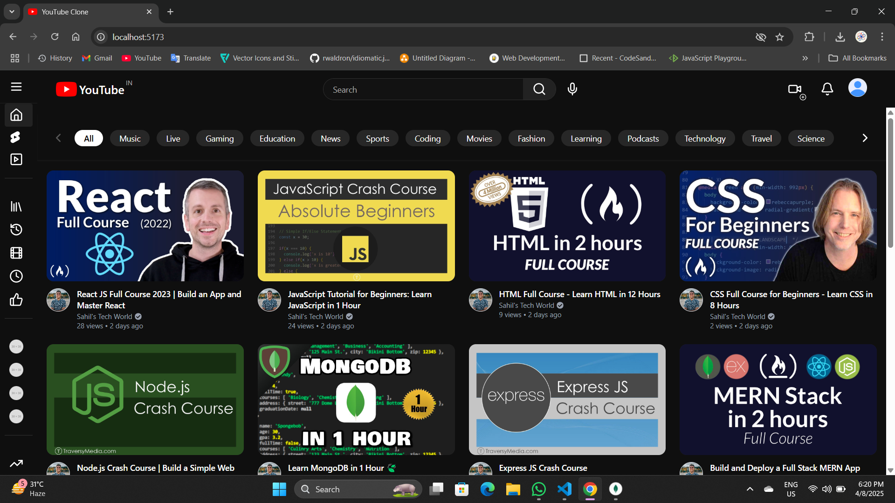
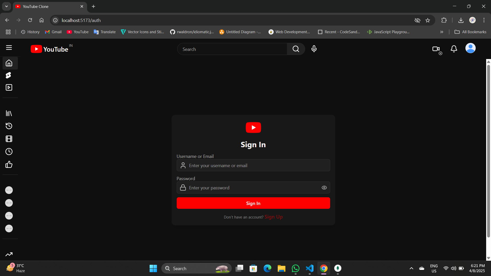
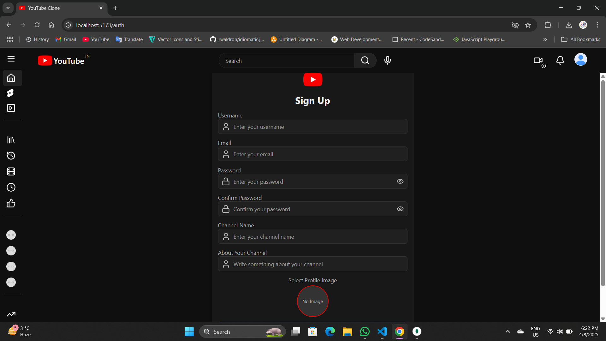
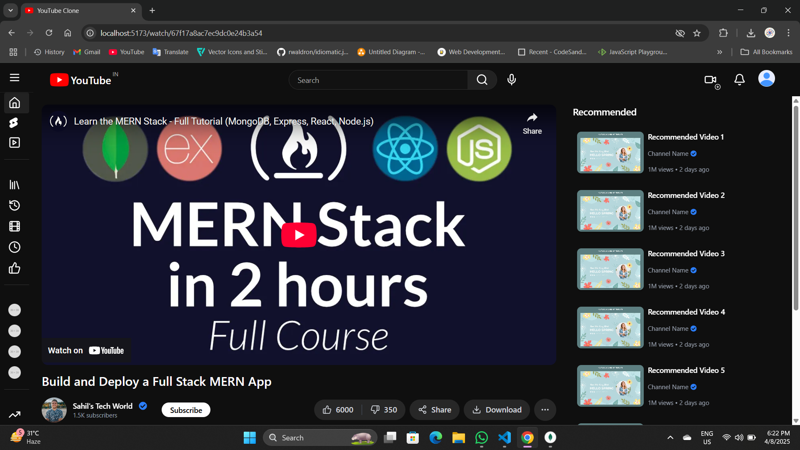
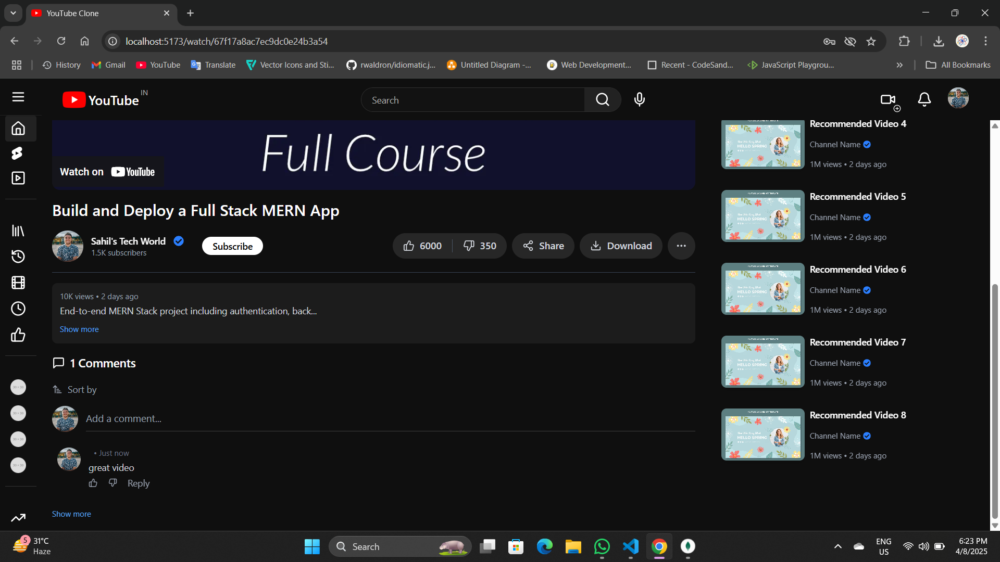
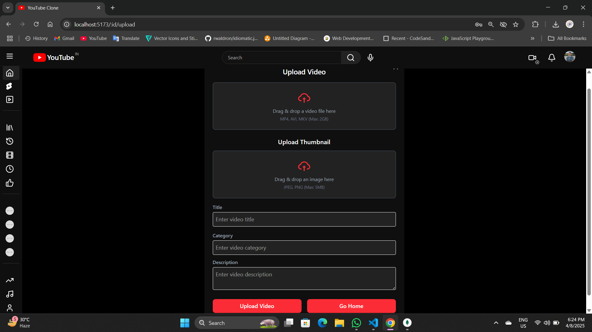

# YouTube Clone 🎥

A full-stack web application that emulates key features of YouTube, including video playback, searching, user authentication, commenting, and liking. This project is designed as a learning and demonstration tool to showcase frontend and backend integration, responsive design, and RESTful API usage.

---

## 🚀 Live Demo

Coming Soon...

---

## 📌 Table of Contents

- [Features](#features)
- [Technologies Used](#technologies-used)
- [Getting Started](#getting-started)
  - [Prerequisites](#prerequisites)
  - [Installation](#installation)
  - [Running the App](#running-the-app)
- [Usage](#usage)
- [Project Structure](#project-structure)
- [Contributing](#contributing)
- [License](#license)
- [Acknowledgments](#acknowledgments)

---

## ✅ Features

- 🎬 Browse, search, and watch videos
- 🔍 Real-time search functionality
- 🔐 User authentication (Login/Signup with JWT)
- ❤️ Add comments
- 🌐 Responsive layout (mobile/tablet/desktop)
- ⚙️ RESTful API for backend communication

---

## 🖼️ Demo Screenshots




 


---

## 🛠️ Technologies Used

### Frontend

- React.js
- Tailwind CSS
- Axios
- React Router

### Backend

- Node.js
- Express.js
- MongoDB with Mongoose
- JSON Web Tokens (JWT)

### Other Tools

- Cloudinary [For Creating video and Image Links]
- dotenv for environment management

---

## 🧰 Getting Started

### 📋 Prerequisites

Make sure you have the following installed:

- Node.js
- npm or yarn
- MongoDB (local or cloud instance)

---

### 📦 Installation

```bash
git clone https://github.com/Sahil-Bhowmick/YouTube-Clone.git
cd YouTube-Clone
```

#### Backend Setup

```bash
cd backend
npm install
```

Create a `.env` file in the backend directory with:

```env
PORT=4000
MONGO_URI=your-mongodb-uri
JWT_SECRET=your-jwt-secret
```

Start the backend server:

```bash
npm start
```

#### Frontend Setup

```bash
cd ../frontend
npm install
```

Create a `.env` file in the frontend directory with:

```env
REACT_APP_API_URL=http://localhost:5173

```

Start the frontend server:

```bash
npm start
```

Visit: `http://localhost:5173`

---

## 📂 Project Structure

```
YouTube-Clone/
├── backend/
│   ├── controllers/
│   ├── models/
│   ├── routes/
│   ├── middleware/
│   └── server.js
├── frontend/
│   ├── src/
│   │   ├── components/
│   │   ├── pages/
│   │   ├── services/
│   │   └── App.js
├── README.md
```

---

## 🧑‍💻 Usage

1. Register or Login
2. Browse videos from homepage
3. Use search bar to find content
4. Click a video to play it
5. Comment on videos (after login)

---

## 🤝 Contributing

Contributions are what make the open-source community such an amazing place to learn, inspire, and create. Any contributions you make are **greatly appreciated**.

### How to Contribute:

1. Fork the Project
2. Create your Feature Branch (`git checkout -b feature/AmazingFeature`)
3. Commit your Changes (`git commit -m 'Add some AmazingFeature'`)
4. Push to the Branch (`git push origin feature/AmazingFeature`)
5. Open a Pull Request

---

## 📜 License

Distributed under the MIT License. See `LICENSE` for more information.

---

## 🙏 Acknowledgments

- YouTube for the core inspiration
- Firebase for media hosting
- Open Source community for the tools and libraries
